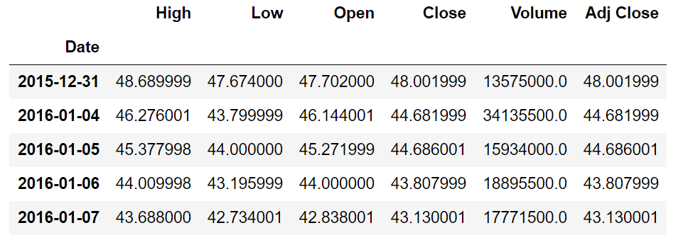
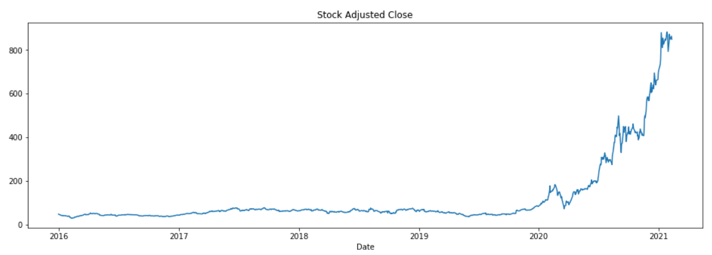
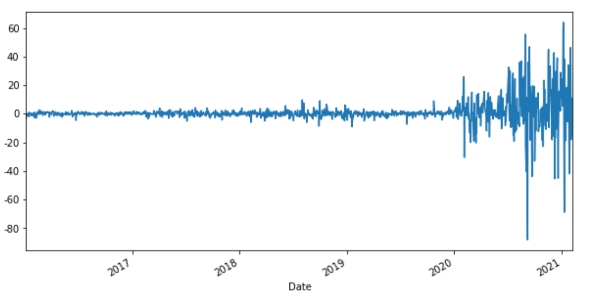
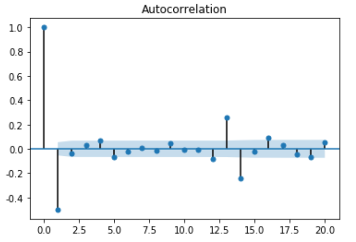
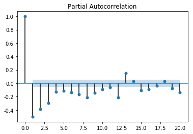
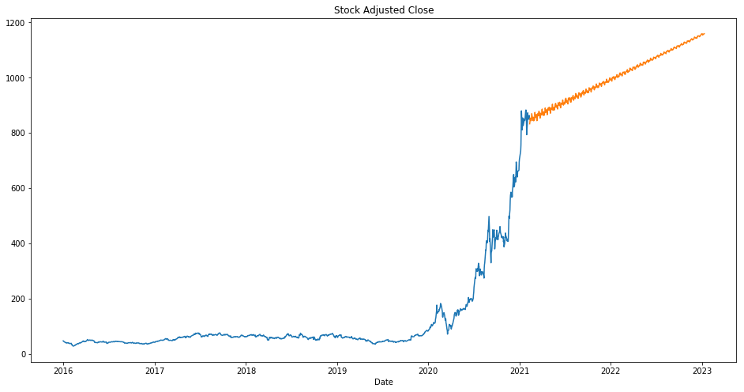

# Time_Series_Stock_Market_Price_Forcast

Tasks include:
#### 1. Use Python 'datareader' package to get stock price of Tesla from Yahoo from 2016-01-01 until now

#### 2. Check Adjusted stock price time series of orginal data

#### 3. Get First-order difference
 
#### 4. Perform Smoothness test and White noise test on First-order difference
        Result: first-order difference series is smooth, but also satisfied white noise, so need to get second-order difference for further processing
#### 5. Get Second-order difference
 
#### 6. Perform Smoothness test and White noise test on Second-order difference
        Result: second-order difference series is smooth, and not satisfied white noise
#### 7. Determine Order using ACF, PACF
 

 
#### 8. Determine oders using AIC and BIC

#### 9. Build model and perform residual test

#### 10. Prediction
 

 

